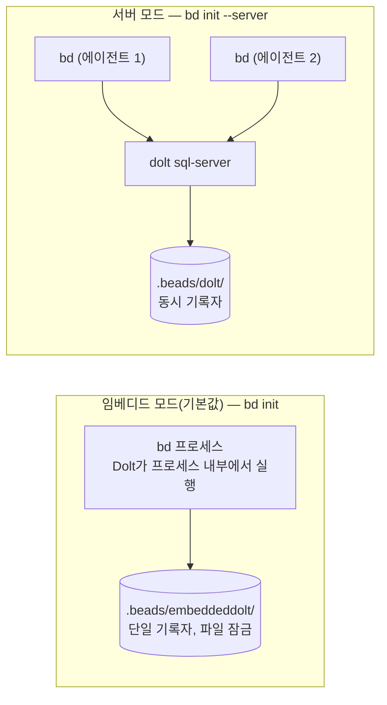

Beads는 Dolt를 저장소 백엔드로 사용합니다. Dolt는 셀 수준 병합, 네이티브 브랜치, 두 가지 배포 모드를 갖춘 버전 관리 SQL 데이터베이스를 제공합니다.

## Dolt를 사용하는 이유

- **네이티브 버전 관리** — 줄 단위가 아닌 셀 수준 diff와 병합
- **다중 기록자 지원** — 서버 모드에서 동시 에이전트 사용 가능
- **내장 기록** — 모든 쓰기가 Dolt 커밋 생성
- **네이티브 브랜치** — git 브랜치와 독립적인 Dolt 브랜치
- **단일 바이너리 옵션** — 개인 사용자를 위한 임베디드 모드(서버 불필요)

## 시작하기

### Dolt 설치(서버 모드 전용)

임베디드 모드는 `bd` 바이너리에 모든 것이 포함되어 있으므로 Dolt를 별도로 설치할
필요가 없습니다. 서버 모드를 실행하거나 `dolt sql`로 데이터베이스를 직접 다루려는
경우에만 독립 실행형 `dolt` CLI를 설치하세요.

```bash
# macOS
brew install dolt

# Linux
curl -L https://github.com/dolthub/dolt/releases/latest/download/install.sh | bash

# 설치 확인
dolt version
```

### 새 프로젝트

```bash
# 임베디드 모드(단일 기록자, 서버 없음 — 독립 실행형 기본값)
bd init

# 서버 모드(다중 기록자, 예: 오케스트레이터)
gt dolt start           # Dolt 서버 시작
bd init --server        # 서버 모드로 초기화
```

### SQLite에서 마이그레이션(레거시)

SQLite를 사용하던 이전 버전에서 업그레이드한다면 다음을 따르세요.

> **참고:** `bd migrate --to-dolt` 명령은 v0.58.0에서 제거되었습니다.
> JSONL 데이터가 있는 0.50 이전 설치에서는 마이그레이션 스크립트를 사용하세요.
>
> ```bash
> scripts/migrate-jsonl-to-dolt.sh
> ```
>
> 마이그레이션 후 연결 오류가 발생하면 [문제 해결](/reference/troubleshooting#circuit-breaker-server-appears-down-failing-fast)을 참조하세요.

마이그레이션은 백업을 자동으로 생성합니다. 원래 SQLite 데이터베이스는 `beads.backup-pre-dolt-*.db`로 보존됩니다.

## 작동 모드



### 임베디드 모드(개인 / 독립 실행형)

프로세스 내부 Dolt 엔진이므로 별도 서버가 필요 없습니다. 독립 실행형 Beads 사용자의
기본값입니다. `bd` 바이너리에 모든 것이 포함되어 있으므로 `bd init`만 실행하면 됩니다.

- 단일 기록자(한 번에 하나의 프로세스)
- 데이터가 코드와 함께 `.beads/embeddeddolt/`에 저장됨
- `bd dolt push`로 GitHub에 푸시 — 코드와 이슈를 한 저장소에 저장
- 운영 작업 없음: 서버, 포트, PID 파일 불필요

### 서버 모드(다중 기록자 / 오케스트레이터)

다중 클라이언트 접근을 위해 실행 중인 `dolt sql-server`에 연결합니다.

```bash
# 서버 시작(오케스트레이터)
gt dolt start

# 또는 수동으로
cd ~/.dolt-data/beads && dolt sql-server --port 3307
```

```bash
# 서버 모드로 초기화
bd init --server

# 또는 환경 변수로 전환
export BEADS_DOLT_SERVER_MODE=1
```

```yaml
# .beads/config.yaml(서버 모드 설정)
dolt:
  mode: server
  host: 127.0.0.1
  port: 3307
  user: root
```

플래그 또는 환경 변수로 연결을 구성합니다.

| 플래그 | 환경 변수 | 기본값 |
|------|---------|---------|
| `--server-host` | `BEADS_DOLT_SERVER_HOST` | `127.0.0.1` |
| `--server-port` | `BEADS_DOLT_SERVER_PORT` | `3307` |
| `--server-socket` | `BEADS_DOLT_SERVER_SOCKET` | (없음, TCP 사용) |
| `--server-user` | `BEADS_DOLT_SERVER_USER` | `root` |
| | `BEADS_DOLT_PASSWORD` | (없음) |

**Unix 도메인 소켓:** TCP 대신 Unix 소켓으로 연결하려면 `--server-socket`을 사용합니다.
동시 실행 프로젝트 간 포트 충돌을 피할 수 있으며, 네트워크 허용 목록보다 파일 수준 접근
제어가 간단한 샌드박스 환경(예: Claude Code)에서 유용합니다. Dolt 서버는
`dolt sql-server --socket <path>`로 시작해야 합니다. 소켓 모드에서는 자동 시작을
지원하지 않습니다.

다음이 필요할 때 서버 모드로 전환하세요.
- 여러 에이전트의 동시 쓰기
- 오케스트레이터 다중 rig 설정
- 원격 피어와의 페더레이션

## 유지 관리 — `bd prune`과 `bd purge`

`bd prune`은 닫힌 비임시 bead를 영구 삭제해 저장소를 회수하고 자동 내보내기 크기를
줄입니다. `bd purge`는 임시 bead(Wisp, 임시 Molecule)에 같은 작업을 수행합니다.
두 명령 모두 실행하려면 `--force`가 필요합니다.

```bash
bd prune --older-than 30d              # 닫힌 지 30일 넘은 bead 미리 보기
bd prune --older-than 30d --force      # 해당 bead 삭제
bd prune --older-than 90d --dry-run    # 통계와 함께 자세히 미리 보기
bd purge --force                       # 닫힌 임시 bead 모두 삭제
```

**참조 인식 보호:** `bd prune`은 열린 bead 또는 진행 중인 bead의 설명, 메모, 댓글에
ID가 나타나는 닫힌 bead를 자동으로 건너뜁니다. 이를 통해 다운스트림 작업에서 여전히
인용하는 ADR, 결정, 검증 bead의 우발적 삭제를 방지합니다. 오래된 것으로 확인된 참조를
정리할 때는 `--ignore-references`로 재정의하세요.

```bash
bd prune --older-than 90d --ignore-references --force
```

`bd purge`는 영향을 받지 않습니다. 임시 bead의 참조도 임시이기 때문입니다. 많은 행을
삭제한 뒤 Dolt 저장소를 완전히 회수하려면 이어서 `bd flatten`을 실행하세요.

<a id="migrating-between-backends"></a>

## 백엔드 간 마이그레이션

`bd backup`을 사용해 임베디드 모드와 서버 모드 간에 데이터를 마이그레이션할 수
있습니다. 양방향 모두 전체 Dolt 커밋 기록을 보존합니다.

`bd export`는 이 흐름을 대신할 수 없습니다. JSONL 내보내기에는 마이그레이션과 상호
운용을 위한 issues 테이블의 이슈 레코드가 포함되지만 Dolt 브랜치, 전체 커밋 기록,
작업 세트 상태 또는 이슈가 아닌 테이블은 담기지 않습니다. 복원 가능한 데이터베이스
백업이 필요하면 `bd backup` 또는 수동 Dolt 백업을 사용하세요.

### 서버 → 임베디드

1. **서버 모드 프로젝트에서 백업 생성:**

   ```bash
   # 서버 모드 프로젝트 디렉터리에서
   bd backup init /path/to/backup-dir
   bd backup sync
   ```

2. **새 임베디드 모드 프로젝트를 만들고 복원:**

   ```bash
   mkdir new-project && cd new-project
   bd init                  # 기본적으로 임베디드 모드 프로젝트 생성
   bd backup restore --force /path/to/backup-dir
   ```

   `--force`는 새로 초기화한 데이터베이스를 백업 내용으로 덮어씁니다. 복원 과정에서
   다음을 자동으로 수행합니다.
   - 복원된 프로젝트 ID와 일치하도록 `metadata.json` 업데이트
   - 향후 `bd backup sync`를 위해 백업 디렉터리 등록
   - 임베디드 마이그레이션 트래커(`schema_migrations`) 백필

3. **확인:**

   ```bash
   bd list
   bd backup status
   ```

### 임베디드 → 서버

1. **임베디드 모드 프로젝트에서 백업 생성:**

   ```bash
   # 임베디드 모드 프로젝트 디렉터리에서
   bd backup init /path/to/backup-dir
   bd backup sync
   ```

2. **새 서버 모드 프로젝트를 만들고 복원:**

   ```bash
   mkdir new-project && cd new-project
   bd init --server         # 서버 모드 프로젝트 생성
   bd backup restore --force /path/to/backup-dir
   ```

3. **확인:**

   ```bash
   bd list
   bd backup status
   ```

### 백업 명령 참조

| 명령 | 설명 |
|---------|-------------|
| `bd backup init <path>` | 백업 대상 등록(파일 시스템 또는 DoltHub URL) |
| `bd backup sync` | 구성된 백업 대상에 데이터베이스 푸시 |
| `bd backup restore [path]` | 백업 디렉터리에서 복원(덮어쓰려면 `--force`) |
| `bd backup remove` | 백업 대상 등록 해제 |
| `bd backup status` | 백업 구성과 마지막 동기화 시간 표시 |

### 참고

- 모드마다 데이터 위치가 다름: `.beads/embeddeddolt/`(임베디드)와 `.beads/dolt/`(서버)
- 백업 디렉터리는 `issues.jsonl` 내보내기가 아닌 전체 Dolt 백업이며 로컬 드라이브, NAS 또는 DoltHub에 둘 수 있음
- 두 프로젝트가 원격을 공유한다면 Dolt 원격(`bd dolt push` / `bd dolt pull`)을 통해 마이그레이션할 수도 있음

아래 섹션이 정식 백엔드 마이그레이션 참조입니다.

## 페더레이션(피어 투 피어 동기화)

페더레이션을 사용하면 독립적인 Dolt 기반 워크스페이스("town")가 중앙 허브 없이
`bd federation add-peer`/`sync`/`status`를 통해 서로 직접 이슈를 동기화할 수
있습니다. 자격 증명은 AES-256으로 암호화되어 로컬에 저장됩니다.

피어 구성, 주권 계층, 동기화/상태/토폴로지 세부 정보 및 문제 해결을 포함한 전체 설정은
[페더레이션 설정 가이드](/multi-agent/federation)를 참조하세요.

## Dolt 원격

`bd dolt remote add`로 원격을 구성하세요. 그러면 실행 중인 Dolt SQL 서버가 원격을
즉시 인식합니다. `dolt` CLI로 직접 추가한 원격은 파일 시스템 구성에 기록되므로 서버를
다시 시작할 때까지 보이지 않을 수 있습니다.

```bash
# DoltHub(공개 또는 비공개)
bd dolt remote add origin https://doltremoteapi.dolthub.com/org/beads

# S3
bd dolt remote add origin aws://[bucket]/path/to/repo

# GCS
bd dolt remote add origin gs://[bucket]/path/to/repo

# Git SSH(GitHub, GitLab 등)
bd dolt remote add origin git+ssh://git@github.com/org/repo.git

# 로컬 파일 시스템
bd dolt remote add origin file:///path/to/remote
```

### 푸시/풀

```bash
bd dolt push
bd dolt pull
```

`bd dolt remote add`는 Dolt 저장소 API를 통해 원격을 등록합니다. SQL 원격은
`bd dolt remote list`, `bd dolt push`, `bd dolt pull`의 원본입니다.

git 프로토콜 원격, 자격 증명이 있는 외부 서버 원격, 현재 셸에만 자격 증명이 있는
클라우드 원격의 경우 `bd dolt push`와 `bd dolt pull`은 `dolt` CLI 전송을 사용하기
전에 일치하는 로컬 CLI 원격을 자동으로 구체화합니다. CLI 원격은 로컬 전송 미러이지
별도 구성 소스가 아닙니다.

이전 beads 버전에서 업그레이드하면서 과거에 원시 `dolt remote add`로 원격을 추가했다면
SQL을 통해 보이도록 `bd dolt remote add <name> <url>`로 다시 등록하세요. `bd doctor`는
레거시 CLI 전용 원격 또는 일치하지 않는 CLI 원격을 `Dolt Remote Migration` 아래에 보고합니다.

> **Git 저장소 공유**: Dolt는 표준 Git 참조(`refs/heads/`, `refs/tags/`)와 별도로
> `refs/dolt/data` 아래에 데이터를 저장합니다. `git+ssh://` 원격이 프로젝트 소스 코드와
> 같은 저장소를 안전하게 가리키도록 할 수 있습니다. [Dolt Git 원격](https://docs.dolthub.com/concepts/dolt/git/remotes)을 참조하세요.

### 원격 나열/제거

```bash
bd dolt remote list            # SQL로 구성된 원격 표시
bd dolt remote remove origin   # 원격 제거
```

## 기여자 온보딩(클론 부트스트랩)

누군가 Dolt 백엔드를 사용하는 저장소를 클론하면 다음을 수행합니다.

1. 클론에서 `bd bootstrap`을 실행합니다.
2. git 원격에 `refs/dolt/data`(`bd dolt push`로 푸시됨)가 있으면 `bd bootstrap`이
   자동 감지하고 원격에서 데이터베이스를 클론합니다.
3. 모든 기존 이슈를 사용할 수 있으며 평소처럼 작업을 계속합니다.

`bd bootstrap` 외에 **수동 단계는 필요 없습니다**. 자동 감지 기능은 다음을 수행합니다.
- `origin`에서 `refs/dolt/data` 탐색
- 새 데이터베이스를 만드는 대신 원격에서 Dolt 데이터베이스 클론
- 향후 `bd dolt push`/`pull`에 사용할 Dolt 원격 구성

`.beads/config.yaml`에 `sync.remote`가 설정되어 있으면 자동 감지보다 우선합니다.
DoltHub, S3, GCS, 파일, git 등 Dolt 호환 원격 URL을 모두 지원합니다. 완전히 새로운
프로젝트에서 `bd init`은 `git origin`을 자동 감지해 `sync.remote`로 영구 저장하므로,
첫 `bd dolt push`가 같은 git 원격의 `refs/dolt/data`에 Dolt 기록을 게시합니다.

### 부트스트랩 작동 확인

```bash
bd list              # 이슈가 표시되어야 함
bd vc status         # 현재 브랜치가 표시되고 커밋되지 않은 변경은 없어야 함
```

## 문제 해결

### 서버가 실행되지 않음

**증상:** 서버 모드 사용 시 연결 거부 오류가 발생합니다.

```
failed to create database: dial tcp 127.0.0.1:3307: connect: connection refused
```

**해결:**
```bash
gt dolt start        # 오케스트레이터 명령
# 또는
gt dolt status       # 실행 중인지 확인
```

### 부트스트랩이 실행되지 않음

**증상:** 새 클론에서 `bd list`에 아무것도 표시되지 않습니다.

**확인:**
```bash
ls .beads/dolt/            # 존재하면 안 됨(부트스트랩 전)
BD_DEBUG=1 bd list         # 부트스트랩 출력 보기
```

**부트스트랩 강제 실행:**
```bash
rm -rf .beads/dolt         # 손상된 상태 제거
bd list                    # 부트스트랩 다시 트리거
```

### 데이터베이스 손상

**증상:** 쿼리가 실패하고 데이터가 일관되지 않습니다.

**진단:**
```bash
bd doctor                  # 기본 검사
bd doctor --deep           # 전체 검증
bd doctor --server         # 서버 모드 검사(해당하는 경우)
```

**복구 옵션:**

1. **수정 가능한 항목 복구:**
   ```bash
   bd doctor --fix
   ```

2. **원격에서 다시 빌드:**
   ```bash
   rm -rf .beads/dolt
   bd list                  # 부트스트랩 다시 트리거
   ```

### `.beads/dolt/`를 이미 Git에 커밋함

실수로 Dolt 데이터 디렉터리를 커밋했다면 다음을 수행합니다.

1. gitignore 업데이트: `bd doctor --fix`
2. git 추적에서 제거: `git rm --cached -r .beads/dolt/`(또는 `.beads/embeddeddolt/`)
3. 제거 사항 커밋: `git commit -m "fix: 실수로 커밋한 dolt 데이터 제거"`
4. 기록에서 완전히 제거하려면 [BFG Repo-Cleaner](https://rtyley.github.io/bfg-repo-cleaner/) 또는 `git filter-repo` 사용

### 잠금 경합(임베디드 모드)

**증상:** "database is locked" 오류가 발생합니다.

임베디드 모드는 단일 기록자입니다(파일 잠금으로 강제). 동시 접근이 필요하면 서버 모드로
전환하세요. [백엔드 간 마이그레이션](#migrating-between-backends)을 참조하세요.

## 구성 참조

```yaml
# .beads/config.yaml

# Dolt 설정
dolt:
  # 쓰기 후 Dolt 기록 자동 커밋(기본값: 임베디드 on, 서버 off)
  auto-commit: on        # on | off

  # 저장소 모드(기본값: embedded)
  mode: embedded         # embedded | server
  # 서버 모드 설정(mode: server일 때만 사용)
  host: 127.0.0.1
  port: 3307
  user: root
  # 비밀번호: 환경 변수 또는 자격 증명 파일(아래 참조)

  # 공유 서버 모드(GH#2377): 모든 프로젝트가 ~/.beads/shared-server/의 단일 Dolt
  # 서버를 공유합니다. 각 프로젝트는 자체 데이터베이스(접두사 기반)를 사용합니다.
  # 다중 프로젝트 머신에서 포트 충돌을 없애고 리소스 사용량을 줄입니다.
  shared-server: false   # true | false
```

### 환경 변수

| 변수 | 용도 |
|----------|---------|
| `BEADS_DOLT_PASSWORD` | 서버 모드 비밀번호(가장 높은 우선순위) |
| `BEADS_CREDENTIALS_FILE` | 자격 증명 파일 경로(기본 위치 재정의) |
| `BEADS_DOLT_SERVER_MODE` | 서버 모드 활성화("1"로 설정) |
| `BEADS_DOLT_SERVER_HOST` | 서버 호스트(기본값: 127.0.0.1) |
| `BEADS_DOLT_SERVER_PORT` | 서버 포트(기본값: 3307, 공유 모드는 3308) |
| `BEADS_DOLT_SERVER_TLS` | TLS 활성화("1" 또는 "true"로 설정) |
| `BEADS_DOLT_SERVER_USER` | MySQL 연결 사용자 |
| `BEADS_DOLT_SHARED_SERVER` | 공유 서버 모드 활성화("1" 또는 "true"로 설정) |
| `DOLT_REMOTE_USER` | 클론/푸시/풀 인증 사용자 |
| `DOLT_REMOTE_PASSWORD` | 클론/푸시/풀 인증 비밀번호 |
| `BD_DOLT_AUTO_COMMIT` | 자동 커밋 설정 재정의 |

### 자격 증명 파일

다중 서버 설정에서는 프로젝트마다 환경 변수를 관리하는 대신 INI 형식 자격 증명 파일에
비밀번호를 저장할 수 있습니다. 비밀번호는 `[host:port]` 섹션으로 조회되므로 각
프로젝트는 구성된 서버에 따라 올바른 비밀번호를 자동으로 가져옵니다.

**비밀번호 확인 순서:**
1. `BEADS_DOLT_PASSWORD` 환경 변수(가장 높은 우선순위, 기존 동작)
2. `[host:port]`로 자격 증명 파일 조회(확인된 런타임 포트 사용)
3. 빈 문자열(비밀번호 없음)

**포트 확인 참고:** 자격 증명 조회에 사용하는 `[host:port]`는 `metadata.json`에 저장된
포트가 아니라 확인된 런타임 포트(포트 파일, 환경 변수, 구성 순의 우선순위)와 일치합니다.
IAP 터널을 사용할 때 중요합니다. 터널이 remote:3307을 localhost:3308에 매핑한다면
비밀번호를 `[127.0.0.1:3308]` 아래에 저장해야 자격 증명 파일이 실제 연결과 일치합니다.

**기본 위치:** `~/.config/beads/credentials`(Linux/macOS), `%APPDATA%\beads\credentials`(Windows)

**위치 재정의:** `BEADS_CREDENTIALS_FILE` 환경 변수를 설정합니다.

**파일 형식:**

```ini
# ~/.config/beads/credentials
[127.0.0.1:3307]
password=localDevPassword

[beads.company.com:3307]
password=teamServerPassword

[10.0.1.50:3308]
password=officePassword
```

**권한:** Linux/macOS에서 그룹 또는 다른 사용자가 파일을 읽을 수 있으면 stderr에
경고가 표시됩니다(ssh 동작과 동일). 다음과 같이 권한을 설정하세요.

```bash
chmod 600 ~/.config/beads/credentials
```

## Dolt 버전 관리

Dolt는 Git과 별도로 자체 버전 기록을 유지합니다.

```bash
# Dolt 커밋에 걸친 이슈 버전 기록 보기
bd history bd-42

# 현재 브랜치와 커밋되지 않은 변경 사항 표시
bd vc status

# 수동 체크포인트 생성
bd vc commit -m "리팩터링 전 체크포인트"
```

### 자동 커밋 동작

**임베디드 모드**(독립 실행형 기본값)에서는 각 `bd` 쓰기 명령이 Dolt 커밋을 생성합니다.

```bash
bd create "새 이슈"      # 이슈와 Dolt 커밋 생성
```

**서버 모드**(오케스트레이터)에서는 서버가 자체 트랜잭션 수명 주기를 관리하므로 자동
커밋의 기본값이 OFF입니다. 동시 부하에서 모든 쓰기 후 `DOLT_COMMIT`을 실행하면
'database is read only' 오류가 발생합니다.

배치 작업(임베디드) 또는 명시적 커밋(서버)을 위해 재정의합니다.

```bash
bd --dolt-auto-commit off create "이슈 1"
bd --dolt-auto-commit off create "이슈 2"
bd vc commit -m "배치: 이슈 생성"
```

## 서버 관리(오케스트레이터)

오케스트레이터는 통합 Dolt 서버 관리를 제공합니다.

```bash
gt dolt start            # 서버 시작(백그라운드)
gt dolt stop             # 서버 중지
gt dolt status           # 서버 상태 표시
gt dolt logs             # 서버 로그 보기
gt dolt sql              # SQL 셸 열기
```

서버는 3307 포트에서 실행됩니다(MySQL의 3306 포트와 충돌 방지).

### 독립 실행형에서 관리형 city로 인계

기존 독립 실행형 프로젝트를 나중에 관리형 city 또는 오케스트레이터에 추가할 때는 두
Dolt 서버가 같은 beads 데이터베이스 이름의 원본이 되지 않도록 하세요. 일반적인
분할 브레인 증상은 `.beads/dolt-server.port`가 이전 독립 실행형 서버를 가리키는 동안
셸 환경은 `BEADS_DOLT_PORT` 또는 `BEADS_DOLT_SERVER_PORT`로 `bd`가 관리형 서버를
가리키게 하는 것입니다.

마이그레이션 전에 확인하세요.

```bash
bd doctor
bd dolt status
```

런타임 관리 포트가 로컬 포트 파일과 다르면 `bd doctor`가 경고합니다. 이 경고는
의도적으로 진단만 수행합니다. 독립 실행형 저장소를 내보내 관리형 서버로 가져올 때까지
로컬 포트 파일을 삭제하지 마세요.

안전한 수동 인계:

```bash
# 관리형 city 포트 재정의가 없는 독립 실행형 프로젝트에서:
unset BEADS_DOLT_PORT BEADS_DOLT_SERVER_PORT
bd backup
bd export > /tmp/beads-standalone.jsonl
bd dolt stop

# 그런 다음 관리형 city 환경으로 들어가 해당 Dolt 서버로 가져오기:
bd import /tmp/beads-standalone.jsonl
bd doctor
```

`bd doctor`에 하나의 정상 저장소가 표시되고 가져온 이슈 수가 올바르면 이전 로컬 Dolt
데이터 디렉터리를 즉시 삭제하지 말고 보관하세요. 관리형 city가 푸시되거나 다른 방식으로
스냅샷될 때까지 백업을 유지합니다.

<a id="shared-server-mode"></a>

### 공유 서버 모드

여러 beads 프로젝트가 있는 머신에서는 일반적으로 프로젝트마다 자체 Dolt 서버를
시작합니다. 공유 서버 모드는 모든 프로젝트를 제공하는 단일 Dolt 서버를
`~/.beads/shared-server/`에서 실행합니다.

```bash
# 이 프로젝트에 활성화(config.yaml 키)
bd config set dolt.shared-server true

# 또는 환경 변수로 머신 전체에 활성화
export BEADS_DOLT_SHARED_SERVER=1

# 또는 초기화 중 활성화
bd init --prefix myproject --shared-server
```

**장점:**
- 프로젝트 간 포트 충돌 없음(3308 포트의 단일 서버로 3307의 오케스트레이터 회피)
- 리소스 사용량 감소(여러 프로세스 대신 하나)
- 자동 데이터베이스 격리(프로젝트마다 자체 데이터베이스 이름 사용)

**작동 방식:**
- 서버 상태 파일(PID, 포트, 잠금, 로그)은 `~/.beads/shared-server/`에 저장
- Dolt 데이터 디렉터리: `~/.beads/shared-server/dolt/`
- 각 프로젝트의 데이터베이스는 하위 디렉터리로 저장(예: `~/.beads/shared-server/dolt/myproject/`)
- 파일 잠금 메커니즘으로 여러 프로젝트의 안전한 동시 접근 보장
- 오케스트레이터와의 충돌을 피하기 위해 기본 포트는 3307이 아닌 3308이며, `BEADS_DOLT_SERVER_PORT` 또는 config.yaml의 `dolt.port`로 재정의

**중요:** 공유 서버의 각 프로젝트에는 **고유한 접두사**(데이터베이스 이름)가 있어야
합니다. 접두사가 같은 두 프로젝트는 같은 데이터베이스를 공유합니다. 실수로 이런
상황이 발생하면 프로젝트 ID 검사에서 불일치를 감지해 연결을 거부하므로 조용한 데이터
손상을 방지합니다. `bd init --shared-server`를 실행할 때는 항상 서로 다른 접두사를 사용하세요.

```bash
# 어느 프로젝트에서든 공유 서버 상태 확인
bd dolt status

# 공유 모드를 포함한 전체 구성 표시
bd dolt show
```

### 데이터 위치(오케스트레이터)

```
<town-root>/.dolt-data/
├── hq/                  # Town의 bead(hq-*)
├── my-project/          # 프로젝트 rig (mp-*)
├── beads/               # Beads용 rig(bd-*)
└── other-project/       # 기타 rig (op-*)
```

### 중앙 Dolt 서버(macOS LaunchAgent)

오케스트레이터를 사용하지 않지만 macOS의 여러 프로젝트에 하나의 지속적인 Dolt 서버를
사용하려면 프로젝트별 임베디드 인스턴스를 생성하는 대신 사용자 지정 `LaunchAgent`를
실행하세요.

#### `brew services start dolt`를 사용하지 않는 이유

`brew install dolt`로 Dolt를 설치하면 자연스러운 다음 단계는 `brew services start dolt`입니다.
하지만 Homebrew Formula는 `--config` 플래그 없이 `dolt sql-server`를 실행하며,
Dolt는 작업 디렉터리에서 `config.yaml`을 자동으로 찾지 않습니다. 구성 파일을
`--config <file>`로 명시적으로 전달해야 합니다.

#### 사용자 지정 LaunchAgent로 설정

Dolt를 설치하고 데이터 디렉터리를 초기화합니다.

```bash
brew install dolt
cd /opt/homebrew/var/dolt && dolt init
```

Dolt가 3307 포트를 사용하도록 구성합니다.

```yaml
# /opt/homebrew/var/dolt/config.yaml
log_level: info

listener:
  host: 127.0.0.1
  port: 3307
  max_connections: 100

behavior:
  autocommit: true
```

LaunchAgent plist를 생성합니다.

```bash
cat > ~/Library/LaunchAgents/com.local.dolt-server.plist << 'EOF'
<?xml version="1.0" encoding="UTF-8"?>
<!DOCTYPE plist PUBLIC "-//Apple//DTD PLIST 1.0//EN"
  "http://www.apple.com/DTDs/PropertyList-1.0.dtd">
<plist version="1.0">
<dict>
    <key>Label</key>
    <string>com.local.dolt-server</string>
    <key>ProgramArguments</key>
    <array>
        <string>/opt/homebrew/bin/dolt</string>
        <string>sql-server</string>
        <string>--config</string>
        <string>/opt/homebrew/var/dolt/config.yaml</string>
    </array>
    <key>WorkingDirectory</key>
    <string>/opt/homebrew/var/dolt</string>
    <key>RunAtLoad</key>
    <true/>
    <key>KeepAlive</key>
    <true/>
    <key>StandardOutPath</key>
    <string>/opt/homebrew/var/log/dolt.log</string>
    <key>StandardErrorPath</key>
    <string>/opt/homebrew/var/log/dolt-error.log</string>
</dict>
</plist>
EOF
```

서비스를 로드하고 확인합니다.

```bash
launchctl load ~/Library/LaunchAgents/com.local.dolt-server.plist
mysql -h 127.0.0.1 -P 3307 -u root -e "SELECT 1"
```

beads가 중앙 서버를 가리키도록 합니다.

```bash
export BEADS_DOLT_SERVER_MODE=1
export BEADS_DOLT_SERVER_PORT=3307
```

서비스를 관리합니다.

```bash
# 중지
launchctl unload ~/Library/LaunchAgents/com.local.dolt-server.plist

# 다시 시작
launchctl unload ~/Library/LaunchAgents/com.local.dolt-server.plist
launchctl load ~/Library/LaunchAgents/com.local.dolt-server.plist

# 로그 확인
tail -f /opt/homebrew/var/log/dolt.log
```

## 고급 Dolt 사용법

`dolt` CLI를 사용하면 고급 사용자 워크플로에서 데이터베이스를 직접 조작할 수 있습니다.
데이터 디렉터리는 모드에 따라 `.beads/embeddeddolt/`(임베디드) 또는
`.beads/dolt/`(서버)입니다.

### 브랜치

```bash
cd .beads/dolt   # 임베디드 모드는 .beads/embeddeddolt
dolt branch feature-x
dolt checkout feature-x
```

### 시간 이동

```bash
dolt log
dolt checkout <commit-hash>
dolt sql -q "SELECT * FROM issues"
```

### Diff와 Blame

```bash
dolt diff main feature-x
dolt blame issues
```

## 마이그레이션 정리

SQLite에서 성공적으로 마이그레이션한 뒤 백업 파일이 남을 수 있습니다.

```
.beads/beads.backup-pre-dolt-20260122-213600.db
.beads/sqlite.backup-pre-dolt-20260123-192812.db
```

Dolt가 작동하는지 확인한 뒤에는 안전하게 삭제할 수 있습니다.

```bash
# Dolt 작동 확인
bd list
bd doctor

# 적절한 대기 기간 후 정리
rm .beads/*.backup-*.db
```

**권장:** 삭제하기 전에 최소 일주일 동안 백업을 유지하세요.

## 함께 보기

- [동기화 개념](/core-concepts/sync-concepts) - 머신 간 동기화의 개념 모델(Dolt 원본, 전송 형식, 안티 패턴)
- [동기화 설정 가이드](/getting-started/sync-setup) - 여러 컴퓨터 간 동기화 설정
- [페더레이션 설정 가이드](/multi-agent/federation) - 피어 투 피어 페더레이션 설정
- [구성](/reference/configuration) - 전체 구성 참조
- [의존성과 Gate](/core-concepts/dependencies) - 의존성과 Gate
- [Git 통합](/reference/git-integration) - Git 워크트리와 보호된 브랜치
- [문제 해결](/reference/troubleshooting) - 일반적인 문제 해결
