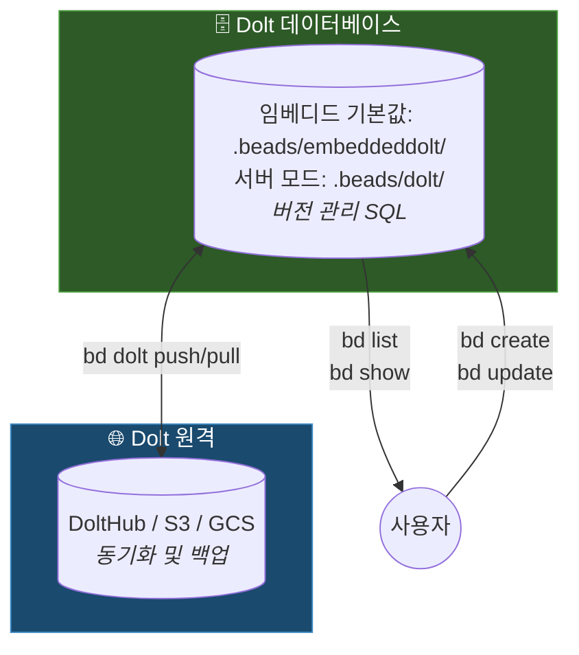

이 문서는 Dolt를 저장소 백엔드로 사용하는 Beads 아키텍처의 작동 방식, 즉 저장소 레이아웃, 데이터 모델, 동기화 경로를 설명합니다. bead, 의존성, 준비된 작업, Molecule 등의 개념 모델은 [Beads 작동 방식](/core-concepts/index)을 참조하세요.

## 아키텍처

Beads는 데이터베이스 수준에서 git과 유사한 의미 체계(브랜치, 병합, diff, 푸시, 풀)를 네이티브로 제공하는 버전 관리 SQL 데이터베이스인 **Dolt**를 유일한 저장소 백엔드로 사용합니다.

기본적으로 Dolt는 **임베디드 모드**(프로세스 내부, 별도 서버 없음)로 실행됩니다. 다중
기록자 설정(여러 에이전트, 오케스트레이터)에서는 실행 중인 `dolt sql-server`에 연결하는
**서버 모드**로 전환합니다. 자세한 내용은 아래 [Dolt 서버 모드](#dolt-server-mode) 섹션을 참조하세요.



<Info>
**원본**
**Dolt**가 원본입니다. 모든 쓰기는 Dolt 기록에 자동 커밋되어 데이터베이스 수준에서 완전한 버전 관리, 브랜치, 병합 기능을 제공합니다.

복구는 간단합니다. `bd dolt pull`로 Dolt 원격에서 풀하거나 `bd backup restore`로 Dolt 네이티브 백업에서 복원합니다.
</Info>

### Dolt를 사용하는 이유

- **버전 관리 SQL**: 네이티브 버전 관리와 함께 전체 SQL 쿼리 제공
- **셀 수준 병합**: 동시 변경 사항을 필드 수준에서 자동 병합
- **다중 기록자**: 서버 모드에서 동시 에이전트 지원
- **네이티브 브랜치**: git 브랜치와 독립적인 Dolt 브랜치
- **오프라인 작동**: 모든 쿼리가 로컬 데이터베이스를 대상으로 실행
- **이식 가능**: `bd export`가 마이그레이션과 상호 운용을 위한 JSONL 생성

## 데이터 모델

데이터베이스는 다섯 종류의 레코드를 저장합니다. 이슈(bead 자체), 의존성(`blocks`, `parent-child`, `related`, `discovered-from` 같은 유형이 지정된 에지), 레이블, 댓글, 이벤트(감사 추적)입니다. 각 항목의 의미와 `bd ready`가 이를 바탕으로 클레임 가능한 경계를 계산하는 방식은 [Beads 작동 방식](/core-concepts/index)에서 다룹니다.

이슈 ID는 내용에서 파생된 해시(`bd-a1b2`)이므로 동시 기록자가 충돌하지 않으며 중앙 ID 조율이 필요 없습니다. 설계는 [해시 기반 ID](/core-concepts/hash-ids)를, 해시 길이와 충돌 확률의 생일 역설 분석은 [COLLISION_MATH](https://github.com/gastownhall/beads/blob/main/engdocs/COLLISION_MATH.md)를 참조하세요.

### 이슈 스키마

Dolt에 저장되고 `bd export` JSONL에 출력되는 모든 이슈의 핵심 필드입니다. 선택적 필드는 비어 있으면 생략됩니다.

| 필드 | 유형 | 설명 |
|-------|------|-------------|
| `id` | string | 고유 해시 ID(예: `bd-a1b2`) |
| `title` | string | 이슈 제목(필수) |
| `description` | string | 자세한 설명(선택) |
| `design` | string | 설계 메모(선택) |
| `acceptance_criteria` | string | 인수 조건(선택) |
| `notes` | string | 추가 메모(선택) |
| `status` | string | `open`, `in_progress`, `blocked`, `deferred`, `closed`, `pinned`, `hooked`(기본값 `open`, `status.custom` 구성 키로 확장 가능) |
| `priority` | int | 0~4, 0은 치명적, 4는 백로그 |
| `issue_type` | string | `bug`, `feature`, `task`, `epic`, `chore`, `decision`, `message`, `molecule`, `gate`, `spike`, `story`, `milestone`(기본값 `task`) |
| `assignee` | string | 할당된 사용자/에이전트(선택) |
| `estimated_minutes` | int | 예상 시간(분)(선택) |
| `created_at` / `updated_at` | RFC3339 | 생성 및 최종 수정 시간 |
| `created_by` | string | 이슈를 생성한 주체(선택) |
| `closed_at` / `close_reason` | RFC3339 / string | 이슈가 닫힐 때 설정(선택) |
| `external_ref` | string | `gh-9` 또는 `jira-ABC` 같은 외부 참조(선택) |
| `metadata` | JSON | 임의 확장 데이터 — [이슈 메타데이터](/core-concepts/metadata) 참조 |
| `labels` | []string | 이슈에 연결된 태그(선택) |
| `dependencies` | []Dependency | 다른 이슈로 향하는 유형 지정 에지(선택) |
| `comments` | []Comment | 토론 스레드(선택) |

이슈에는 일정(`due_at`, `defer_until`), 클레임 임대(`lease_expires_at`, `heartbeat_at`), Gate(`await_type`, `await_id`, `timeout`), Molecule/Wisp 필드(`ephemeral`, `mol_type`, `bonded_from`) 등 워크플로 계층 필드 그룹도 있습니다.

내부 필드인 `content_hash`(변경 감지에 사용하는 이슈 정식 내용의 SHA-256), `source_repo`, `id_prefix`는 내보내기에 나타나지 않습니다.

스키마는 기본적으로 안정적입니다. 새로운 일급 필드를 제안하기 전에 통합, 오케스트레이터 또는 팀 전용 데이터에는 `metadata` 필드를 우선 사용하세요. [프로젝트 헌장의 스키마 경계](https://github.com/gastownhall/beads/blob/main/engdocs/PROJECT_CHARTER.md#schema-boundary)를 참조하세요.

## 데이터 흐름

### 쓰기 경로
```text
사용자가 bd create 실행
    → Dolt 데이터베이스 업데이트
    → Dolt 기록에 자동 커밋
```

### 읽기 경로
```text
사용자가 bd list 실행
    → Dolt SQL 쿼리
    → 결과 즉시 반환
```

### 동기화 경로
```text
사용자가 bd dolt push 실행
    → 커밋을 Dolt 원격에 푸시

사용자가 bd dolt pull 실행
    → 원격 커밋을 페치하고 병합
```

Dolt 원격은 DoltHub, S3, GCS, 파일 시스템 경로 또는 기존 git 원격에 둘 수 있습니다. 이슈 기록은 코드 브랜치와 별도로 `refs/dolt/data` 아래에 저장됩니다. 전송 형식과 설정은 [동기화 개념](/core-concepts/sync-concepts)을 참조하세요.

저장소 간 설정은 [페더레이션](/multi-agent/federation)을 통해 bead를 피어 투 피어로 교환할 수도 있습니다. 임시 [Wisp](/workflows/wisps)는 기본적으로 페더레이션 푸시에서 제외되므로 실행 추적이 공유 기록에 들어가지 않습니다.

### 다중 머신 동기화 고려 사항

여러 머신 또는 클론에서 작업할 때는 다음을 따르세요.

1. **머신을 전환하기 전에 항상 동기화**
   ```bash
   bd dolt push  # 떠나기 전에 변경 사항 푸시
   ```

2. **새 이슈를 생성하기 전에 풀**
   ```bash
   bd dolt pull  # 새 머신에서 먼저 변경 사항 풀
   bd create "새 이슈"
   ```

3. **병렬 수정 방지** - 두 머신이 동기화 없이 동시에 이슈를 생성하더라도 Dolt의 셀 수준 병합이 대부분의 충돌을 자동으로 처리하지만, 가능하면 피하세요.

다중 머신 워크플로의 데이터 손실 방지(패턴 A5/C3)는 [동기화 실패 복구](/recovery/sync-failures)를 참조하세요.

<a id="dolt-server-mode"></a>

## Dolt 서버 모드

다음과 같은 백그라운드 동기화와 데이터베이스 작업을 Dolt 서버가 처리합니다.

- Dolt 데이터베이스 백엔드 관리
- 변경 추적을 위한 자동 커밋 처리
- 여러 에이전트의 동시 접근 제공
- 런타임 파일은 `.beads/` 바로 아래에 위치: `dolt-server.pid`, `dolt-server.log`, `dolt-server.port`

선택적 *공유 서버* 모드는 모든 프로젝트에 대해 `~/.beads/shared-server/`에서 하나의 Dolt 서버를 실행합니다. `config.yaml`의 `dolt.shared-server: true` 또는 `BEADS_DOLT_SHARED_SERVER=1`로 활성화합니다. [Dolt 백엔드](/architecture/dolt#shared-server-mode)를 참조하세요.

<Tip>
`bd dolt start`로 Dolt 서버를 시작합니다. `bd doctor`로 상태를 확인합니다.
</Tip>

### 임베디드 모드(서버 없음)

임베디드 모드가 기본값(플래그 없는 `bd init`)입니다. Dolt는 프로세스 내부에서 단일 기록자로 실행되고 데이터는 `.beads/embeddeddolt/`에 저장됩니다. 서버 프로세스와 별도 Dolt 설치가 필요 없습니다. 서버 모드는 `bd init --server`로 선택하며 선택 사항은 `.beads/metadata.json`에 영구 저장됩니다.

```bash
bd create "CI가 생성한 이슈"
bd dolt push
```

**개인 사용 외에도 임베디드 모드는 다음에 적합합니다.**
- CI/CD 파이프라인(Jenkins, GitHub Actions)
- Docker 컨테이너
- 임시 환경
- 백그라운드 프로세스를 남기면 안 되는 스크립트

### 다중 클론 시나리오

<Warning>
**다중 클론 워크플로의 경쟁 조건**
같은 저장소의 여러 git 클론이 동기화 작업을 동시에 실행하면 푸시/풀 중 경쟁 조건이 발생할 수 있습니다. 특히 다음 환경에서 흔합니다.
- 다중 에이전트 AI 워크플로(여러 Claude/GPT 인스턴스)
- 여러 체크아웃이 있는 개발자 워크스테이션
- 워크트리 기반 개발 워크플로

**예방:**
1. 클론 간에 전환하기 전에 Dolt 서버를 중지합니다(`bd dolt stop`).
2. Dolt는 서버 모드에서 워크트리를 네이티브로 처리합니다.
3. 자동화된 워크플로에는 임베디드 모드를 사용합니다.
</Warning>

동기화 경쟁 조건 문제 해결(패턴 B2)은 [동기화 실패 복구](/recovery/sync-failures)를 참조하세요.

## 디렉터리 레이아웃

```text
.beads/
├── embeddeddolt/     # Dolt 데이터베이스(임베디드 모드, 기본값) — git에서 무시
├── dolt/             # Dolt 데이터베이스(서버 모드) — git에서 무시
├── dolt-server.pid   # 서버 모드 런타임 파일(.pid, .log, .port) — git에서 무시
├── issues.jsonl      # 뷰어와 교환을 위한 수동 JSONL 내보내기
├── metadata.json     # 백엔드 구성 — git에서 추적
└── config.yaml       # 프로젝트 구성(선택) — git에서 추적
```

선택한 모드의 데이터베이스 디렉터리만 이슈 데이터를 보유하며, 나머지는 구성, 런타임 상태 또는 파생된 내보내기입니다. `bd init`은 데이터베이스와 런타임 파일이 git에 포함되지 않도록 `.beads/.gitignore`를 작성합니다.

## 복구 모델

Dolt 버전 관리 덕분에 복구가 간단합니다.

1. **데이터베이스를 잃었나요?** → Dolt 원격에서 풀: `bd dolt pull`
2. **백업이 있나요?** → 백업 복원: `bd backup restore [path] --force`
3. **병합 충돌이 있나요?** → Dolt가 셀 수준 병합을 네이티브로 처리

`bd backup init`(파일 시스템 경로 또는 DoltHub 대상)으로 백업을 만들고 `bd backup sync`로 푸시합니다. Dolt 네이티브 백업은 전체 커밋 기록을 보존하지만 JSONL 내보내기는 그렇지 않습니다.

### 범용 복구 순서

다음 순서로 보고된 문제 대부분을 해결할 수 있습니다. 자세한 절차는 [복구 런북](/recovery/index)을 참조하세요.

```bash
bd dolt stop                 # Dolt 서버 중지(경쟁 조건 방지)
git worktree prune           # 고아 워크트리 정리
bd dolt pull                 # Dolt 원격에서 풀
bd dolt start                # 서버 다시 시작
```

<Warning>
**`bd doctor --fix`를 주의해서 사용하세요**
`bd doctor --fix`를 실행하기 전에 항상 백업하고 미리 보세요.

1. **먼저 백업:** `cp -r .beads .beads.backup`
2. **변경 사항 미리 보기:** `bd doctor --dry-run` — 변경하지 않고 수정될 항목 표시
3. **진단 검토:** `bd doctor`(플래그 없음) — 진단만 수행, 변경 없음
4. **그다음 수정:** `bd doctor --fix` — 또는 각 수정 사항을 개별 확인하려면 `bd doctor --fix -i`

**주의해야 하는 이유:** `--fix` 플래그는 유효한 부모-자식 관계를 포함해 순환으로 표시된 의존성을 제거할 수 있습니다. 표시된 의존성이 잘못되었다고 확신할 때만 `--fix-child-parent`를 사용하세요.

**기타 진단 도구:**
- `bd blocked` — 차단된 이슈와 그 이유 확인
- `bd show <issue-id>` — 특정 이슈의 상태 검사
</Warning>

구체적인 절차는 [복구](/recovery/index)를, Dolt 복구 단계는 [데이터베이스 손상 복구](/recovery/database-corruption)를 참조하세요.

## 설계 결정

### Dolt를 사용하는 이유

Dolt는 git과 유사한 의미 체계를 네이티브로 제공하는 버전 관리 SQL 데이터베이스입니다. 일반 SQLite(바이너리 병합 충돌) 또는 JSONL(느린 쿼리)과 달리 Dolt는 빠른 SQL 쿼리와 올바른 병합 의미 체계를 모두 제공합니다.

### 클라우드 서버를 사용하지 않는 이유

Beads는 오프라인 우선, 로컬 우선 개발을 위해 설계되었습니다. Dolt 서버는 로컬에서 실행되므로 클라우드 의존성, 다운타임, 공급업체 종속이 없으며 비행기 안이나 제한된 네트워크에서도 모든 기능을 사용할 수 있습니다.

### 절충점

| 장점 | 절충점 |
|---------|-----------|
| 오프라인 작동 | 실시간 협업 없음 |
| 버전 관리 데이터베이스 | 동시 기록자에는 서버 모드 필요 |
| 셀 수준 병합 | 초기 설정 필요 |
| 로컬 우선 속도 | 원격에 수동 동기화 |
| SQL 쿼리 | Dolt 저장소 엔진 의존성 |

### Beads를 사용하면 안 되는 경우

Beads는 다음 용도에 적합하지 않습니다.

- **대규모 팀(10명 이상)** — Git 기반 동기화는 고빈도 동시 수정에 적합하게 확장되지 않음
- **비개발자** — Git과 명령줄 사용 경험 필요
- **실시간 협업** — 실시간 업데이트가 없고 명시적 동기화 필요
- **리치 미디어 첨부 파일** — 텍스트 기반 이슈 추적용으로 설계됨

이러한 사용 사례에는 GitHub Issues, Linear 또는 Jira를 고려하세요.

## 관련 문서

- [Beads 작동 방식](/core-concepts/index) — 개념 모델: bead, 의존성, 준비된 작업, Molecule
- [동기화 개념](/core-concepts/sync-concepts) — 머신 간 동기화, 전송 형식, 안티 패턴
- [Dolt 백엔드](/architecture/dolt) — 임베디드 모드와 서버 모드, 공유 서버, 마이그레이션 상세 정보
- [복구 런북](/recovery/index) — 일반적인 문제의 단계별 절차
- [CLI 참조](/cli-reference/index) — 전체 명령 문서
- [시작하기](/index) — 설치와 첫 단계
- [프로젝트 헌장](https://github.com/gastownhall/beads/blob/main/engdocs/PROJECT_CHARTER.md) — 제품 범위와 경계(기여자 문서)
- [내부 구조](https://github.com/gastownhall/beads/blob/main/engdocs/INTERNALS.md) — 구현 세부 정보(기여자 문서)
