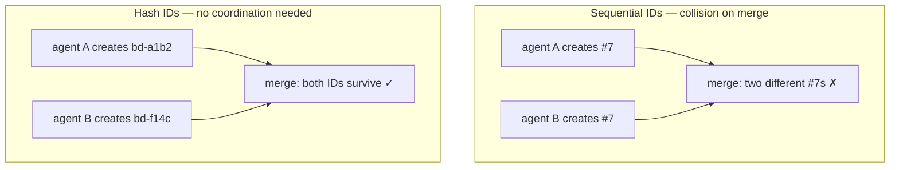

Understanding beads' collision-resistant ID system.

## The Problem

Traditional sequential IDs (`#1`, `#2`, `#3`) break when:
- Multiple agents create issues simultaneously
- Different branches have independent numbering
- Forks diverge and later merge



## The Solution

Beads uses hash-based IDs:

```
bd-a1b2c3    # Short hash
bd-f14c      # Even shorter
bd-a3f8e9.1  # Hierarchical (child of bd-a3f8e9)
```

**Properties:**
- Globally unique (content-based hash)
- No coordination needed between creators
- Merge-friendly across branches
- Predictable length (configurable)

## How Hashes Work

IDs are generated from:
- Issue title
- Creation timestamp
- Random salt

```bash
# Create issue - ID assigned automatically
bd create "Fix authentication bug"
# Returns: bd-7x2f

# The ID is deterministic for same content+timestamp
```

## Hierarchical IDs

For epics and subtasks:

```bash
# Parent epic
bd create "Auth System" -t epic
# Returns: bd-a3f8e9

# Children auto-increment
bd create "Design UI" --parent bd-a3f8e9    # bd-a3f8e9.1
bd create "Backend" --parent bd-a3f8e9      # bd-a3f8e9.2
bd create "Tests" --parent bd-a3f8e9        # bd-a3f8e9.3
```

Benefits:
- Clear parent-child relationship
- No namespace collision (parent hash is unique)
- Up to 3 levels of nesting

## ID Configuration

Configure ID prefix and length:

```bash
# Set prefix (default: bd)
bd config set id.prefix myproject

# Set hash length (default: 4)
bd config set id.hash_length 6

# New issues use new format
bd create "Test"
# Returns: myproject-a1b2c3
```

## Collision Handling

While rare, collisions are handled automatically:

1. On import, if hash collision detected
2. Beads appends disambiguator
3. Both issues preserved

```bash
# Check for collisions
bd info --schema --json | jq '.collision_count'
```

## Working with IDs

```bash
# Partial ID matching
bd show a1b2     # Finds bd-a1b2...
bd show auth     # Fuzzy match by title

# Full ID required for ambiguous cases
bd show bd-a1b2c3d4

# List with full IDs
bd list --full-ids
```

### `bd comment` requires the full id

Every command above resolves an abbreviation the same way — but `bd comment
<id> "text"` (and its `bd comments add` twin) is the one deliberate exception:
it accepts only a full, exact id, never an abbreviation. This is a policy
trade for an agent fleet, not an oversight: an abbreviation that happens to be
a leading-prefix match for the wrong issue would silently write the comment
there instead of erroring, and a comment write has no confirmation step to
catch it before the message lands on the wrong issue. Reads and every other
mutation (`show`, `close`, `update`, …) keep accepting abbreviations as
documented above.

```bash
bd show a1b2              # OK — abbreviation resolves for reads
bd close a1b2              # OK — abbreviation resolves for other writes
bd comment a1b2 "text"     # refused — comment writes require the full id
bd comment bd-a1b2c3d4 "text"   # OK — use the full id from `bd show`
```

A reserved word (`list`, `add`, `rm`, `delete`) as the id positional is
refused the same way, for a related reason: `bd comment list "text"` almost
always means the caller confused the singular shorthand with the plural `bd
comments list`/`bd comments add <id> "text"`, not that an issue is literally
named `list`.

## Migration from Sequential IDs

If migrating from a system with sequential IDs:

```bash
# Bootstrap from a JSONL export (preserves original IDs in metadata)
bd init --from-jsonl old-issues.jsonl

# View original ID
bd show bd-new --json | jq '.original_id'
```

## Best Practices

1. **Use short references** - `bd-a1b2` is usually unique enough, except on
   `bd comment` writes, which require the full id (see
   [Working with IDs](#working-with-ids) above)
2. **Use `--json` for scripts** - Parse full ID programmatically
3. **Reference by hash in commits** - `Fixed bd-a1b2` in commit messages
4. **Let hierarchies form naturally** - Create epics, add children as needed
