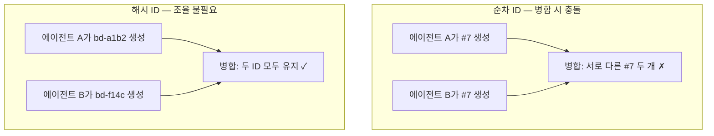

beads의 충돌 방지 ID 시스템을 알아봅니다.

## 문제

기존의 순차 ID(`#1`, `#2`, `#3`)는 다음 상황에서 문제가 생깁니다.
- 여러 에이전트가 동시에 이슈를 생성합니다.
- 서로 다른 브랜치가 독립적인 번호 체계를 사용합니다.
- 포크가 갈라졌다가 나중에 병합됩니다.



## 해결 방법

Beads는 해시 기반 ID를 사용합니다.

```
bd-a1b2c3    # 짧은 해시
bd-f14c      # 더 짧은 해시
bd-a3f8e9.1  # 계층적(bd-a3f8e9의 자식)
```

**특성:**
- 전역적으로 고유함(내용 기반 해시)
- 생성자 간 조율이 필요 없음
- 브랜치 간 병합에 적합함
- 예측 가능한 길이(구성 가능)

## 해시 작동 방식

ID는 다음 값으로 생성됩니다.
- 이슈 제목
- 생성 타임스탬프
- 무작위 솔트

```bash
# 이슈 생성 - ID 자동 할당
bd create "인증 버그 수정"
# 반환: bd-7x2f

# 내용과 타임스탬프가 같으면 ID가 결정적으로 생성됩니다.
```

## 계층적 ID

Epic과 하위 작업에는 다음과 같이 사용합니다.

```bash
# 부모 epic
bd create "인증 시스템" -t epic
# 반환: bd-a3f8e9

# 자식 번호 자동 증가
bd create "UI 설계" --parent bd-a3f8e9      # bd-a3f8e9.1
bd create "백엔드" --parent bd-a3f8e9       # bd-a3f8e9.2
bd create "테스트" --parent bd-a3f8e9       # bd-a3f8e9.3
```

장점:
- 명확한 부모-자식 관계
- 네임스페이스 충돌 없음(부모 해시가 고유함)
- 최대 3단계 중첩

## ID 구성

ID 접두사와 길이를 구성합니다.

```bash
# 접두사 설정(기본값: bd)
bd config set id.prefix myproject

# 해시 길이 설정(기본값: 4)
bd config set id.hash_length 6

# 새 이슈는 새 형식 사용
bd create "테스트"
# 반환: myproject-a1b2c3
```

## 충돌 처리

드물지만 충돌이 발생하면 자동으로 처리됩니다.

1. 가져올 때 해시 충돌을 감지합니다.
2. Beads가 구분자를 덧붙입니다.
3. 두 이슈를 모두 보존합니다.

```bash
# 충돌 확인
bd info --schema --json | jq '.collision_count'
```

## ID 사용하기

```bash
# 부분 ID 일치
bd show a1b2     # bd-a1b2... 찾기
bd show auth     # 제목으로 퍼지 일치

# 모호한 경우 전체 ID 필요
bd show bd-a1b2c3d4

# 전체 ID로 나열
bd list --full-ids
```

## 순차 ID에서 마이그레이션

순차 ID를 사용하는 시스템에서 마이그레이션하는 경우 다음을 실행합니다.

```bash
# JSONL 내보내기에서 부트스트랩(메타데이터에 원래 ID 보존)
bd init --from-jsonl old-issues.jsonl

# 원래 ID 보기
bd show bd-new --json | jq '.original_id'
```

## 모범 사례

1. **짧은 참조 사용** - 일반적으로 `bd-a1b2`면 충분히 고유합니다.
2. **스크립트에서는 `--json` 사용** - 전체 ID를 프로그래밍 방식으로 파싱합니다.
3. **커밋에서 해시로 참조** - 커밋 메시지에 `Fixed bd-a1b2`를 사용합니다.
4. **계층을 자연스럽게 구성** - epic을 만들고 필요에 따라 자식을 추가합니다.
