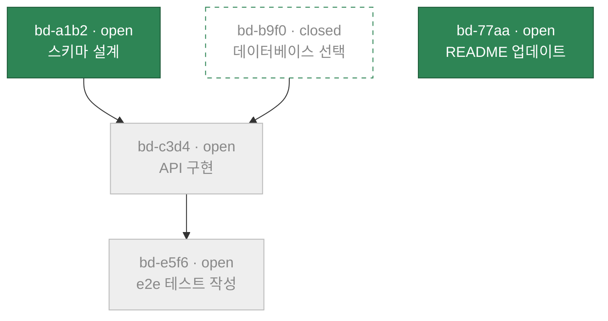
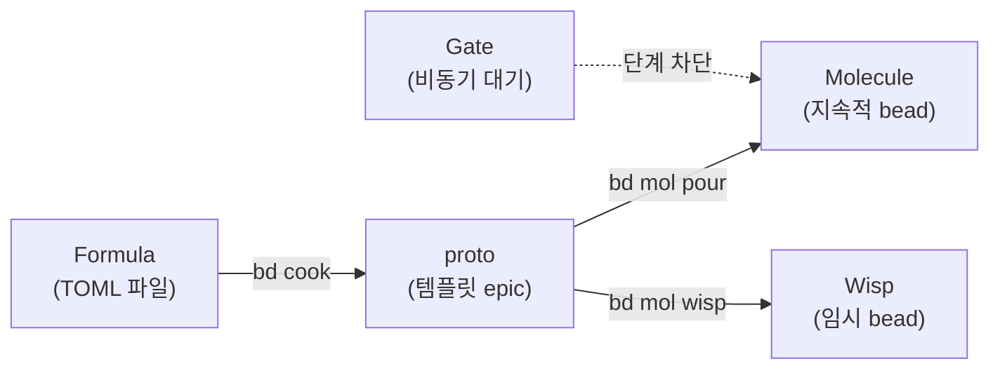
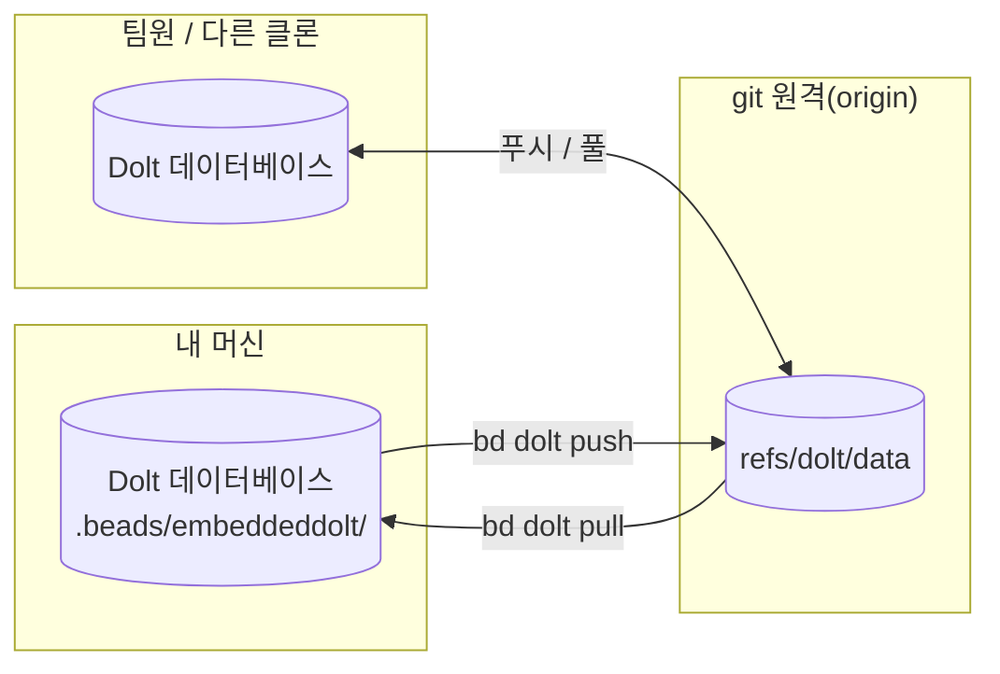

코딩 에이전트는 세션이 끝날 때마다 기억을 잃습니다. Markdown 계획은 낡고 TODO 주석은
흩어지며, 에이전트가 중단되면 컨텍스트도 함께 사라집니다. Beads는 이를 **지속적이고
구조화된 작업 그래프**로 대체합니다. 모든 작업 단위는 버전 관리 데이터베이스의
**bead**(이슈)이며 의존성으로 연결되고, `bd ready`는 지금 당장 작업할 수 있는 항목을
정확히 계산합니다. 작업은 에이전트보다 오래 유지되며, 다음 세션은 이전 세션이 중단된
지점부터 이어갑니다.

```mermaid
flowchart LR
    create["bd create<br/>새 bead"] --> graph["의존성<br/>그래프"]
    graph --> ready["bd ready<br/>클레임 가능한 작업"]
    ready --> claim["bd update --claim<br/>에이전트가 가져감"]
    claim --> close["bd close<br/>작업 완료"]
    close -->|차단 요소 해제| ready
```

위 루프는 제품 전체를 축소해 보여 줍니다. bead를 생성하고 닫으면 그래프가 재구성되며,
사람이 배정하는 것이 아니라 그래프가 다음에 작업 가능한 항목을 결정합니다.

## Beads와 의존성

**bead**는 추적되는 하나의 작업 단위입니다. 해시 ID(`bd-a1b2`), 제목, 유형(`bug`,
`task`, `feature`, `epic`, `chore` 등 — [`bd types`](/cli-reference/types) 참조),
우선순위(`0` 치명적 → `4` 백로그), `open` → `in_progress` → `closed`로 이동하는
상태를 가집니다. "bead"와 "issue"는 같은 대상을 뜻합니다. CLI에서는 issue,
제품에서는 bead라고 부릅니다.

**의존성**은 bead를 그래프로 연결합니다. 두 가지 에지 유형이 에이전트가 작업할 수
있는 항목을 결정합니다.

| 유형 | 의미 | 준비된 작업에 영향 |
|------|---------|--------------------|
| `blocks` | 엄격한 순서 — 차단 요소를 먼저 닫아야 함 | **있음** |
| `parent-child` | epic/하위 작업 구조 | **간접적** — 차단된 부모가 자식을 차단함 |
| `discovered-from` | 출처 — 부모 작업 중 발견됨 | 없음 |
| `related` | 느슨한 연관 관계 | 없음 |

워크플로 단계에는 두 가지 차단 유형(`conditional-blocks`, `waits-for`)이 더 있습니다.
[Molecules](/workflows/molecules)를 참조하세요. 더 풍부한 지식 그래프 에지
(`relates-to`, `duplicates`, `supersedes`, `replies-to`)는
[그래프 링크](/core-concepts/graph-links)에서 다룹니다.

## 준비된 작업 — `bd ready`가 계산하는 항목

**준비된 작업**은 그래프에서 클레임 가능한 경계입니다. 열린 차단 요소가 없는 열린 bead
중에서 진행 중이거나, 차단되었거나, 연기되었거나, Gate에 보류된 항목을 제외합니다.
에이전트는 트래커 전체를 훑지 않습니다. 경계를 요청하고 원자적으로 클레임합니다.



여기서 `bd ready`는 `bd-a1b2`와 `bd-77aa`를 반환합니다. 다른 모든 항목은 닫혔거나
열린 차단 요소를 기다리고 있습니다. `bd-a1b2`를 닫으면 `bd-c3d4`가 준비 상태가 되며
아무것도 다시 계획할 필요가 없습니다.

```bash
bd ready --json            # 클레임 가능한 경계, 기계 판독 가능
bd ready --claim --json    # 첫 일치 항목을 원자적으로 클레임
```

## 해시 ID — 에이전트가 충돌하지 않는 이유

`bd-a1b2` 같은 ID는 순차 번호가 아니라 내용(제목, 설명, 생성자, 생성 시간과 충돌
nonce)에서 파생된 해시입니다. 두 에이전트(또는 두 브랜치)가 동시에 bead를 생성해도
같은 ID를 만들 수 없으므로 병합할 때 작업 번호가 바뀌지 않습니다. 해시 길이는 충돌 시
자동으로 늘어나며 데이터베이스 크기에 맞게 확장됩니다. [해시 ID](/core-concepts/hash-ids)와
[적응형 ID 길이](/core-concepts/adaptive-ids)를 참조하세요.

## 워크플로 — Formula → proto → Molecule

반복 가능한 다단계 작업은 한 번 선언한 뒤 필요할 때 생성합니다.



- **Formula**는 소스입니다. 단계의 DAG를 정의하는 TOML/JSON 파일입니다.
  [Formulas](/workflows/formulas)를 참조하세요.
- Cooking은 Formula를 **proto**로 컴파일합니다. proto는 `{{variables}}`가 있는 템플릿
  epic이며 아직 실제 작업은 아닙니다.
- Pouring은 **Molecule**을 인스턴스화합니다. 단계가 다른 모든 작업처럼 `bd ready`를
  통과하는 실제 bead입니다. [Molecules](/workflows/molecules)를 참조하세요.
- **Wisp**는 수명이 임시인 동일한 인스턴스화 결과로 다음 `bd purge` 때 사라집니다.
  [Wisps](/workflows/wisps)를 참조하세요.
- **Gate**는 사람의 승인, 타이머, GitHub 실행 또는 PR 같은 외부 이벤트가 발생할 때까지
  단계를 보류합니다. [Gates](/workflows/gates)를 참조하세요.

## 동기화 — 머신 간에 작업이 이동하는 방식

Beads는 모든 것을 버전 관리 SQL 데이터베이스인 [Dolt](https://github.com/dolthub/dolt)에
저장합니다. 모든 쓰기는 Dolt 기록에 자동 커밋됩니다. 동기화는 별도 참조 아래에서 기존
git 원격을 함께 사용하는 네이티브 푸시/풀이므로 실행할 서버가 없습니다.



`.beads/issues.jsonl`은 뷰어와 교환을 위한 수동 내보내기입니다. 데이터베이스도,
동기화 프로토콜도, 백업도 아닙니다. 전체 모델과 안티 패턴은
[동기화 개념](/core-concepts/sync-concepts)에 있습니다. 저장소와 조직 간 피어 투 피어
공유인 **페더레이션**은 [페더레이션](/multi-agent/federation)을 참조하세요.

## 저장소 모드

| 모드 | 명령 | 데이터 위치 | 기록자 |
|------|---------|---------------|---------|
| **임베디드**(기본값) | `bd init` | `.beads/embeddeddolt/` | 하나(파일 잠금) |
| **서버** | `bd init --server` | `.beads/dolt/` | 여러 동시 기록자 |

임베디드 모드는 Dolt를 프로세스 내부에서 실행하며 거의 모든 사용자에게 적합합니다.
서버 모드는 다중 기록자 설정을 위해 외부 `dolt sql-server`에 연결합니다.
[Dolt 백엔드](/architecture/dolt)와 [아키텍처 개요](/architecture/index)를 참조하세요.

## 다음 단계

- [빠른 시작](/getting-started/quickstart) — 설치하고 첫 bead를 생성, 클레임, 종료합니다.
- [이슈와 의존성](/core-concepts/issues) — bead와 그 관계의 필드 수준 세부 정보입니다.
- [워크플로](/workflows/index) — Molecule, Formula, Gate, Wisp를 자세히 설명합니다.
- [다중 에이전트](/multi-agent/index) — 에이전트 집단을 위한 라우팅, 조정, 페더레이션입니다.
