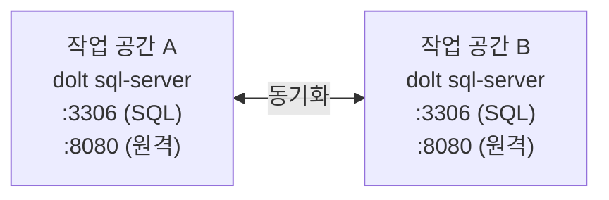

federation은 Dolt 원격을 사용하여 여러 워크스페이스의 Beads 데이터베이스를
peer-to-peer로 동기화합니다. 각 워크스페이스는 자체 데이터베이스를 유지하면서 설정된
peer와 작업 항목을 공유합니다.

## 개요

federation은 Dolt의 분산 버전 관리 기능으로 독립적인 팀이나 위치 간 이슈 데이터를
동기화합니다. 주요 이점은 다음과 같습니다.

- **peer-to-peer**: 중앙 서버가 필요 없고 각 town이 자율적으로 작동합니다.
- **데이터베이스 native versioning**: 파일 export가 아닌 Dolt 버전 관리를 기반으로 합니다.
- **유연한 인프라**: DoltHub, S3, GCS, 로컬 경로 또는 SSH와 함께 작동합니다.
- **데이터 sovereignty**: GDPR, 지역 법률 등 규정 준수를 위한 tier를 설정할 수 있습니다.

## 사전 요구 사항

1. **Dolt backend**: federation에는 유일하게 지원되는 Dolt 저장소 backend가 필요합니다.

## 설정

### federation 호환 동기화 활성화

`.beads/config.yaml` 또는 `~/.config/bd/config.yaml`을 편집하세요.

```yaml
federation:
  remote: dolthub://myorg/beads          # 주 원격(선택 사항)
  sovereignty: T2                        # 데이터 sovereignty tier
```

또는 환경 변수를 사용하세요.

```bash
export BD_FEDERATION_REMOTE="dolthub://myorg/beads"
export BD_FEDERATION_SOVEREIGNTY="T2"
```

### 데이터 주권 등급

| 등급 | 설명 | 사용 사례 |
|------|-------------|----------|
| T1 | 제한 없음 | 공개 데이터 |
| T2 | 조직 수준 | 지역/회사 규정 준수 |
| T3 | 가명화 | 식별자 제거 |
| T4 | 익명화 | 최대 개인정보 보호 |

## federation peer 추가

`bd federation add-peer`로 원격 peer를 등록하세요.

```bash
bd federation add-peer <name> <endpoint>
```

### peer 이름 규칙

- 문자로 시작해야 합니다.
- 영숫자, dash, underscore만 사용할 수 있습니다.
- 최대 64자입니다.

### 지원되는 endpoint 형식

| 형식 | 예제 | 설명 |
|--------|---------|-------------|
| DoltHub | `dolthub://org/repo` | DoltHub가 host하는 저장소 |
| Google Cloud | `gs://bucket/path` | Google Cloud Storage |
| Amazon S3 | `s3://bucket/path` | Amazon S3 |
| 로컬 | `file:///path/to/backup` | 로컬 filesystem |
| HTTPS | `https://host/path` | HTTPS 원격 |
| SSH | `ssh://host/path` | SSH 원격 |
| Git SSH | `git@host:path` | Git SSH 단축 형식 |

### 예제

```bash
# DoltHub에 staging 환경 추가
bd federation add-peer staging dolthub://myorg/staging-beads

# cloud backup 추가
bd federation add-peer backup gs://mybucket/beads-backup
bd federation add-peer backup-s3 s3://mybucket/beads-backup

# 로컬 backup 추가
bd federation add-peer local file:///home/user/beads-backup

# partner 조직 추가
bd federation add-peer partner-town dolthub://partner-org/beads
```

### 자격 증명

`--user`와 선택적 `--password`로 설정한 peer는 SQL credential을 AES-256으로
암호화하여 로컬에 저장합니다. 비밀번호를 생략하면 대화형으로 요청합니다. 저장된
credential은 동기화할 때 자동으로 사용됩니다.

```bash
bd federation add-peer town-gamma 192.168.1.100:3306/beads --user sync-bot
```

### JSON 출력

scripting에는 `--json` flag를 사용하세요.

```bash
bd --json federation add-peer staging dolthub://myorg/staging-beads
# {"added":"staging","url":"dolthub://myorg/staging-beads","has_auth":false,"sovereignty":""}
```

### 설정 확인

설정된 peer를 나열하세요.

```bash
bd federation list-peers
```

## peer와 동기화

`bd federation sync`로 peer town에서 pull하고 push하며, `bd federation status`로
데이터를 전송하지 않고 동기화 상태를 확인합니다.

```bash
# 모든 peer와 동기화
bd federation sync

# 특정 peer와 동기화
bd federation sync --peer town-beta

# 충돌 처리
bd federation sync --strategy theirs  # 또는 'ours'

# 상태 확인(ahead/behind, reachability, 충돌)
bd federation status
bd federation status --peer town-beta
```

`--strategy`가 없을 때 merge 충돌이 발생하면 동기화를 일시 중지하고 자동으로
해결하는 대신 수동 해결할 충돌 table을 보고합니다.

### 토폴로지

| 패턴 | 설명 | 사용 사례 |
|---------|-------------|----------|
| hub-spoke | 중앙 hub, satellite가 hub와 동기화 | 중앙 조정을 사용하는 팀 |
| mesh | 모든 peer가 서로 동기화 | 분산 협업 |
| 계층형 | hub 트리 | 다중 팀 조직 |

## 아키텍처 참고 사항

### 작동 방식

1. 각 워크스페이스에 자체 Dolt 데이터베이스가 있습니다.
2. `add-peer`가 `git remote add`와 비슷하게 Dolt 원격을 등록합니다.
3. `bd federation sync`가 peer 간 commit을 push하고 pull합니다.
4. 충돌 해결은 설정된 strategy를 따릅니다.

Dolt SQL 서버에서 실행할 때 federation은 포트 두 개를 사용합니다. 다중 writer SQL
접근에는 MySQL(3306), peer-to-peer push/pull에는 remotesapi(8080)를 사용합니다.



### 다중 저장소 지원

이슈는 `SourceSystem`을 추적하여 어느 federated system에서 생성되었는지 식별합니다.
이를 통해 조직 간 출처 표시와 trust chain을 올바르게 유지할 수 있습니다.

### 연결성

원격 연결은 peer를 추가할 때가 아니라 첫 push/pull 작업에서 검증합니다. 따라서
인프라가 준비되기 전에 원격을 설정할 수 있습니다.

## 계획된 기능

다음 작업은 인프라에서 지원하지만 아직 명령으로 노출되지 않았습니다.

- `bd federation push <peer>` / `bd federation pull <peer>` - peer 하나와 단방향
  동기화합니다. 양방향은 이미 `bd federation sync`가 지원합니다.

## 문제 해결

### "requires direct database access"

federation 명령에는 데이터베이스에 직접 접근할 수 있는 Dolt backend가 필요합니다.
federation 작업용 Dolt backend가 설정되었는지 확인하세요.

### "peer already exists"

해당 이름의 peer가 이미 설정되어 있습니다. 다른 이름을 사용하거나 `bd federation
list-peers`로 기존 peer를 확인하세요.

### 잘못된 endpoint 형식

endpoint가 위의 지원 형식 중 하나와 일치하는지 확인하세요. scheme은 `dolthub://`,
`gs://`, `s3://`, `file://`, `https://`, `ssh://` 또는 Git SSH 형식
(`git@host:path`)이어야 합니다.

### 일반 상태 검사

```bash
bd doctor --deep
```

## 참조

- 설정: 모든 federation 설정은 [설정](/reference/configuration) 참고
- 소스: `cmd/bd/federation.go`
- 저장소 인터페이스: `internal/storage/versioned.go`
- Dolt 구현: `internal/storage/dolt/store.go`
