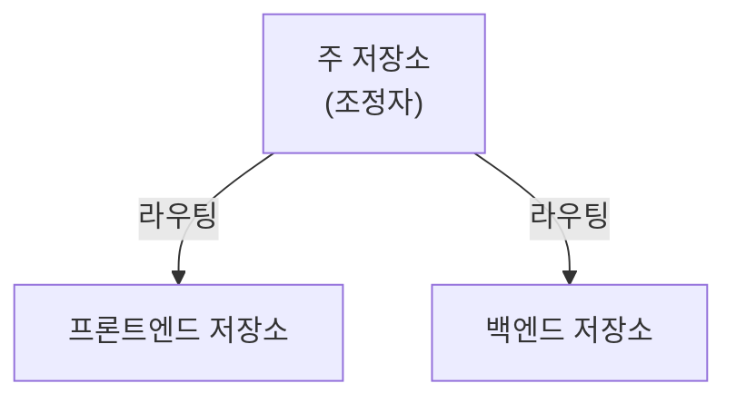

Beads는 여러 AI 에이전트와 저장소 간 조정을 지원합니다.

## 개요

다중 에이전트 기능은 다음을 지원합니다.

- **routing** - 올바른 저장소로 이슈를 자동 routing
- **저장소 간 의존성** - 저장소 경계를 넘는 의존성
- **에이전트 조정** - 에이전트 간 작업 할당과 handoff

## 핵심 개념

### 라우팅

routing은 역할(contributor 또는 maintainer)과 `routing.*` 설정 key를 기준으로 새
Bead가 들어갈 저장소를 결정합니다. 명시적 `--repo` flag가 항상 우선합니다. 결정
흐름과 설정 참조는 [다중 저장소 routing](/multi-agent/routing)을 참고하세요.

### 작업 할당

작업을 할당하거나 원자적으로 claim합니다.

```bash
bd assign bd-42 agent-1        # bd update bd-42 --assignee agent-1의 단축 명령
bd update bd-42 --claim        # assignee 및 in_progress를 원자적으로 설정
bd ready --claim --json        # 첫 번째 준비된 일치 항목 claim
```

### 저장소 간 의존성

저장소 간 의존성을 추적합니다.

```bash
bd dep add bd-42 external:other-repo:api-ready
```

## 아키텍처



## 시작하기

1. **단일 저장소**: 표준 Beads 워크플로
2. **다중 저장소**: route와 저장소 간 의존성 설정
3. **다중 에이전트**: 작업 할당과 handoff 추가

## 이 섹션의 문서

- [routing](/multi-agent/routing) — 저장소 간 자동 이슈 routing과 `BEADS_DIR` 해석
- [조정](/multi-agent/coordination) — 에이전트 간 작업 할당과 handoff 패턴
- [federation](/multi-agent/federation) — 저장소와 조직 간 Beads peer-to-peer 공유
- [다중 저장소 마이그레이션](/multi-agent/multi-repo-migration) — 기존 단일 저장소 설정을 다중 저장소 routing으로 이전
