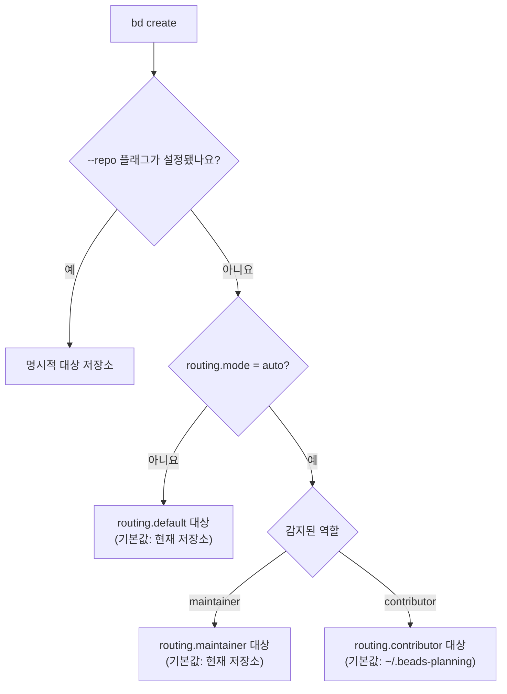

에이전트 하나가 OSS fork와 비공개 계획 저장소, 구현 저장소에 작업을 공급하는 계획
저장소, 한 머신의 여러 프로젝트 checkout처럼 둘 이상의 저장소에서 작업할 때가
많습니다. **routing**은 각 새 Bead를 받을 저장소의 데이터베이스를 결정합니다. 따라서
contributor의 계획이 upstream PR을 오염시키지 않고 maintainer의 Beads는 프로젝트에
바로 들어갑니다.

routing은 opt-in 방식입니다. routing 설정이 없으면 모든 Bead가 현재 저장소에
들어가므로 이 페이지의 어떤 내용도 단일 저장소 워크플로를 바꾸지 않습니다.

## contributor 문제

Beads를 사용하는 OSS 프로젝트를 fork했다고 가정합니다. 생성하는 모든 계획 Bead가
fork의 `.beads/` 데이터에 쓰이면서, 여는 모든 PR에서 fork의 이슈 데이터베이스가
upstream과 달라집니다. 필요한 것은 프로젝트 *안에서* 계획하지 않고 프로젝트에
*관한* 계획을 자유롭게 하는 것입니다.

routing은 역할을 감지하고 `bd create`를 upstream에 push하지 않는 별도 계획
저장소(기본값 `~/.beads-planning`)로 redirect하여 이 문제를 해결합니다.

## 라우팅 결정 방식

`bd create`를 실행하면 엄격한 우선순위에 따라 대상 저장소를 선택합니다.

1. `--repo <path>` - 명시적 재정의이며 항상 우선
2. `routing.mode: auto` - 감지된 역할(maintainer 또는 contributor)에 따라 라우팅
3. `routing.default` - 나머지 경우. 기본값은 현재 저장소인 `.`



읽기도 같은 라우팅을 따릅니다. 라우팅이 활성화되면 `bd list`와 `bd ready`가
라우팅된 저장소에서 읽고, `bd show` 같은 ID 조회는 로컬에서 Bead를 찾지 못할 때
라우팅된 저장소를 대체 경로로 사용합니다.

## 역할 감지

auto 모드를 구동하는 역할은 Git 설정에서 가져오며 `beads.role`이 단일 원본입니다.

```bash
bd config set beads.role contributor   # 데이터베이스가 아닌 Git 설정에 저장
bd config get beads.role
```

`beads.role`이 설정되지 않으면 `bd`가 경고를 출력하고 더 이상 권장되지 않는 원격 URL
heuristic을 대체 경로로 사용합니다.

| Git 원격 상황 | 감지된 역할 |
|---|---|
| `origin`과 `upstream`이 다른 저장소를 가리킴(fork 워크플로) | contributor |
| SSH `origin`(`git@...`, `ssh://`) 또는 credential이 있는 HTTPS | maintainer |
| credential이 없는 일반 HTTPS `origin` | contributor |
| 원격 설정 없음(로컬 프로젝트) | maintainer |

<Note>
SSH는 push 권한을 확실히 나타내지 않습니다. fork contributor도 SSH로 클론하는 경우가
많습니다. `beads.role`을 명시적으로 설정하면 heuristic과 경고가 실행되지 않습니다.
</Note>

## 설정

### contributor 역할

```bash
cd ~/projects/my-fork
bd init --contributor
```

대화형 wizard는 다음 작업을 수행합니다.

1. `.beads/` 디렉터리가 있는 자체 Git 저장소로 계획 저장소(기본값
   `~/.beads-planning`)를 생성합니다.
2. `routing.mode: auto`와 `routing.contributor`를 계획 저장소로 설정합니다.
3. routing된 Beads가 계속 보이도록 계획 저장소를 `repos.additional`에 추가합니다.
   [hydration](#multi-repo-hydration)을 참고하세요.
4. fork에서는 `bd dolt pull`이 fork가 아닌 소스 저장소에서 이슈 데이터를 가져오도록
   동기화가 `upstream` 원격을 가리키게 합니다.

일반 `bd init`도 `origin`과 다른 `upstream` 원격이라는 fork 패턴을 감지하여 같은
contributor 설정을 자동 적용합니다. 사용하지 않으려면 `--role maintainer`를
지정하세요.

### 팀

```bash
bd init --team
```

저장소 하나를 공유하는 팀은 일반적으로 routing이 필요하지 않습니다. routing을
설정하지 않으면 모든 Bead가 공유 저장소에 들어갑니다. 팀 wizard는 team 모드와 보호된
main 설정에서 이슈 commit용 별도 동기화 브랜치 등 공유 워크플로의 나머지를 설정합니다.
비공개 scratch 공간이 필요한 팀원은 실험을 명시적으로 routing합니다.

```bash
bd create "대안 접근법 시도" --repo ~/.beads-planning-personal
```

두 상황과 다중 단계 및 다중 persona 설정의 전체 단계별 안내는 [다중 저장소
마이그레이션](/multi-agent/multi-repo-migration)에 있습니다.

## 설정 참조

`bd config set <key> <value>`로 설정하세요. 저장 위치는 [설정
참조](/reference/configuration)를 참고하세요.

| key | 기본값 | 의미 |
|---|---|---|
| `routing.mode` | 설정 안 됨 | `auto`는 역할에 따라 routing하고 `explicit` 또는 설정 안 됨은 모두 `routing.default`로 전송 |
| `routing.default` | `.` | auto 모드가 꺼졌을 때 대상 |
| `routing.maintainer` | `.` | auto 모드에서 maintainer 대상 |
| `routing.contributor` | `~/.beads-planning` | auto 모드에서 contributor 대상 |
| `repos.primary` | 설정 안 됨 | 다중 저장소 hydration의 주 저장소 |
| `repos.additional` | 설정 안 됨 | Beads를 hydrate할 저장소 |
| `beads.role` | 설정 안 됨 | 명시적 역할: `maintainer` 또는 `contributor`(Git 설정에 저장) |

유효 설정과 각 값을 가져온 위치를 확인하세요.

```bash
bd config show            # 모든 소스: config.yaml, 데이터베이스, Git, 환경 변수
bd config validate        # routing.mode 값과 관련 설정 검사
bd where                  # 이 디렉터리가 실제로 사용하는 데이터베이스
```

## Bead별 override

`--repo`는 Bead 하나에 대해 routing을 완전히 우회합니다.

```bash
bd create "upstream 버그 수정" --repo .            # 현재 저장소 강제 지정
bd create "비공개 실험" --repo ~/scratch           # 다른 저장소 강제 지정
```

## 발견한 작업은 상위 항목과 같은 위치에 유지

`discovered-from` 의존성이 있는 Bead는 상위 항목의 `source_repo`를 상속합니다. 따라서
작업을 실행하면서 발견한 작업은 역할과 관계없이 해당 작업과 같은 저장소에 귀속됩니다.

```bash
bd create "인증에서 race 발견" --deps discovered-from:bd-abc
# bd-abc의 source_repo 상속
```

상속을 override하려면 `--repo`를 추가하세요.

<a id="multi-repo-hydration"></a>

## 다중 저장소 hydration

routing은 Beads를 다른 저장소에 쓰므로 현재 데이터베이스에는 해당 Beads가 없습니다.
**hydration**은 다른 저장소의 Beads를 현재 데이터베이스로 import하고 각각의
`source_repo`를 지정하여 `bd list`와 `bd ready`가 통합된 보기를 표시하게 합니다.

다른 저장소를 `repos.additional`에 나열하여 설정하세요.

```bash
bd repo add ~/.beads-planning    # hydrate할 저장소 추가
bd repo list                     # 주 저장소와 추가 저장소 표시
bd repo sync                     # 모든 추가 저장소에서 Beads import
bd repo remove ~/.beads-planning # 제거하고 hydrate된 Beads 삭제
```

`bd repo sync`는 각 추가 저장소의 `.beads/issues.jsonl` export를 읽고 원래 prefix와
`source_repo`를 설정하여 Beads를 import합니다. export가 변경되지 않은 저장소는
건너뜁니다. `bd init --contributor`는 hydration을 자동으로 연결하고, routing 대상이
`repos.additional`에 없으면 `bd doctor`가 경고합니다.

hydrate된 다른 저장소의 Beads는 데이터베이스의 일반 row가 됩니다. 출처로 필터링하거나
일반 의존성으로 연결하세요.

```bash
bd list --json | jq '.[] | select(.source_repo == "~/.beads-planning")'
bd dep add impl-42 plan-10 --type blocks
```

특정 Beads가 아닌 다른 프로젝트의 *기능*에 대한 의존성에는 `bd dep add`가
`external:<project>:<capability>` 대상도 허용합니다. [`bd
dep`](/cli-reference/dep)을 참고하세요.

## 에이전트 하나와 여러 프로젝트

여러 저장소에서 작업하는 AI 에이전트는 Beads MCP 서버 인스턴스를 *하나만* 실행해야
합니다.

```json
{
  "beads": {
    "command": "beads-mcp",
    "args": []
  }
}
```

서버는 각 요청의 작업 디렉터리에서 Beads 워크스페이스를 해석합니다. 따라서 설정 하나가
모든 프로젝트를 지원하면서 각 프로젝트는 격리된 자체 데이터베이스를 유지합니다.
기본 embedded Dolt는 `.beads/embeddeddolt/`, server 모드는 `.beads/dolt/`를
사용합니다. 프로젝트마다 MCP 인스턴스를 실행하면 작업이 잘못된 데이터베이스에 들어갈
수 있습니다.

프로젝트별 embedded 저장소 대신 모든 프로젝트에서 Dolt 서버 하나를 공유하려면 `bd
init --shared-server`로 초기화하거나 `BEADS_DOLT_SHARED_SERVER=1`을 설정하세요.
프로젝트는 `~/.beads/shared-server/`의 서버를 공유하면서 이슈 prefix 이름을 사용하는
프로젝트별 데이터베이스에서 격리 상태를 유지합니다. 설치와 클라이언트 설정은 [MCP
서버](/integrations/mcp-server)를 참고하세요.

## 문제 해결

### Beads가 잘못된 저장소에 들어감

```bash
bd config get routing.mode         # auto인지 확인
bd config get beads.role           # 명시적 역할이 설정되었는지 확인
bd config show --source git        # Git 설정이 제공하는 값
```

역할을 명시적으로 설정하거나(`bd config set beads.role maintainer`), Bead 하나의
대상을 강제로 지정하거나(`--repo .`), 역할 감지를 완전히 비활성화하세요(`bd config set
routing.mode explicit`).

### 라우팅된 Beads가 bd list에 표시되지 않음

routing 대상이 hydrate되지 않습니다. 추가하고 동기화하세요.

```bash
bd repo add ~/.beads-planning
bd repo sync
```

`bd doctor`가 이 잘못된 설정을 감지합니다.

### 발견한 Beads가 "잘못된" 저장소에 표시됨

의도된 동작입니다. `discovered-from` 의존성이 있는 Beads는 상위 항목의
`source_repo`를 상속합니다. 생성할 때 `--repo`로 override하세요.

### 계획 Beads가 upstream PR에 표시됨

계획 저장소는 별도 Git 저장소여야 하며 fork에 commit하면 안 됩니다.

```bash
ls ~/.beads-planning/.git              # 존재해야 함
bd config get routing.contributor      # 계획 저장소를 가리켜야 함
```

### bd create마다 역할 경고 표시

`bd`는 URL heuristic을 대체 경로로 사용할 때 경고합니다. 영구적으로 끄려면 역할을 설정하세요.

```bash
bd config set beads.role maintainer    # 또는 contributor
```

## 관련 페이지

- [다중 저장소 마이그레이션](/multi-agent/multi-repo-migration) — contributor, 팀, 다중 단계 워크플로의 전체 설정 안내
- [에이전트 조정](/multi-agent/coordination) — 에이전트 간 작업 할당과 claim
- [federation](/multi-agent/federation) — 저장소와 조직 간 Beads peer-to-peer 공유
- [`bd init`](/cli-reference/init), [`bd config`](/cli-reference/config), [`bd repo`](/cli-reference/repo), [`bd create`](/cli-reference/create) — 명령 참조
